本文着重讲 GitHub 自动化部署，创建 VuePress 官方文档比较详细，就不说啦。

## 创建VuePress项目

<https://v2.vuepress.vuejs.org/zh/>

当然呢，可以参考我的项目

<https://github.com/AmosWang0626/AmosWang0626.github.io>

使用 yarn 命令打包部署：

```
# install
yarn install

# start
yarn dev

# build
yarn build
```

## Github 自动化部署

### 步骤概览

1.  创建**个人维度**的 Github Token（后边自动化部署 push 代码需要）
1.  创建**项目维度**的变量，值就是上一步生成的密钥
1.  创建流水线，自动化打包发布
1.  打包发布完成，切换到 gh-pages 分支，等站点自动化部署完，就能访问啦～

### 第一步：创建 Token

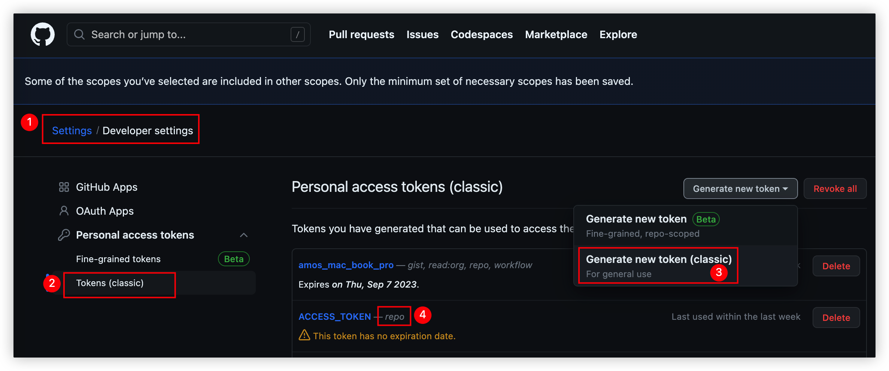

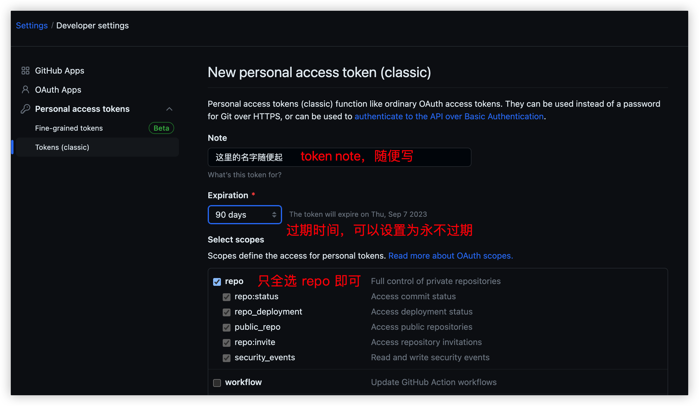

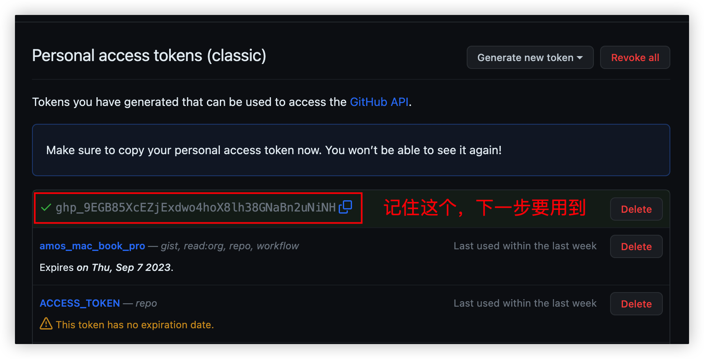

### 第二步：创建项目变量

这里创建项目维度的变量，下一步创建的脚本里边要用到。

名字就取 ACCESS_TOKEN ，值就是上一步生成的密钥。

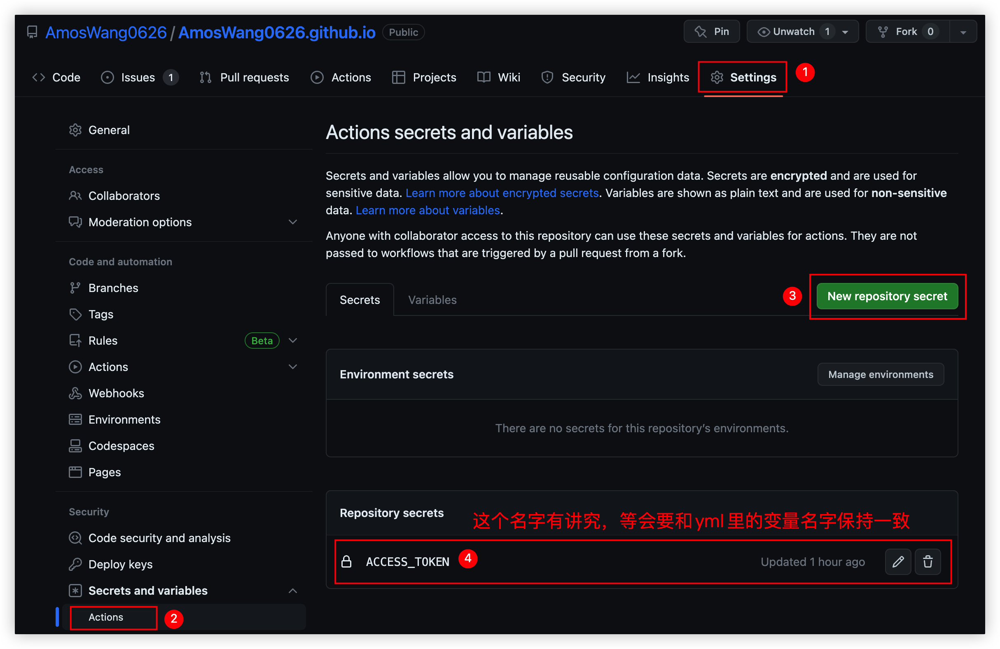

### 第三步：创建流水线，自动化打包发布

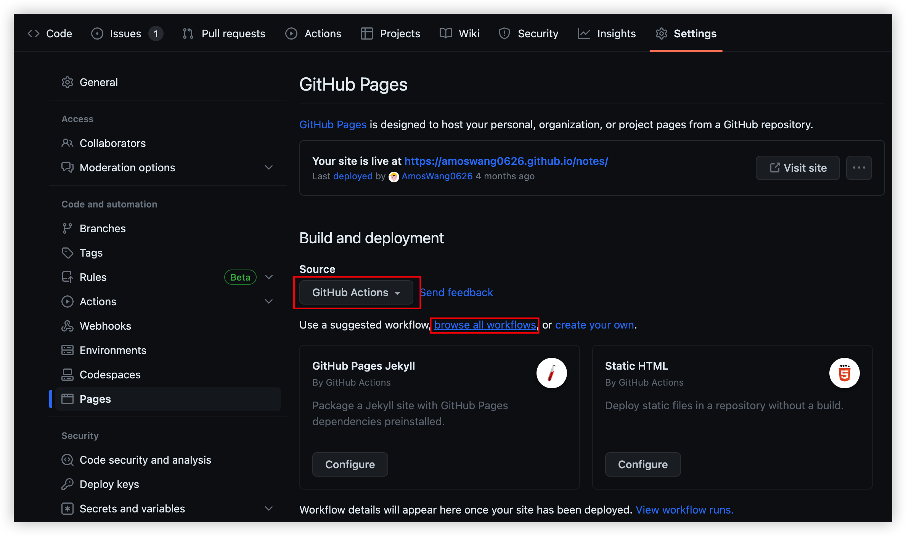

这里前端项目是 node.js 技术栈，就搜索 node 了

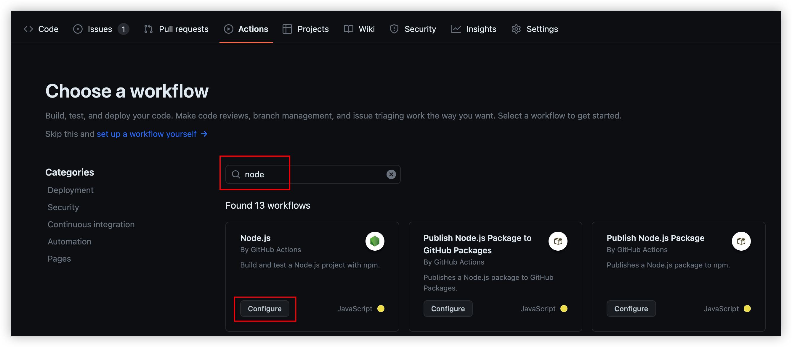

```
# This workflow will do a clean installation of node dependencies, cache/restore them, build the source code and run tests across different versions of node
# For more information see: https://docs.github.com/en/actions/automating-builds-and-tests/building-and-testing-nodejs

name: Node.js CI

on:
  push:
    branches: [ "master" ]
  pull_request:
    branches: [ "master" ]

jobs:
  build:

    runs-on: ubuntu-latest

    strategy:
      matrix:
        node-version: [18.x]
        # See supported Node.js release schedule at https://nodejs.org/en/about/releases/

    steps:
      - uses: actions/checkout@v3
      - name: Use Node.js ${{ matrix.node-version }}
        uses: actions/setup-node@v3
        with:
          node-version: ${{ matrix.node-version }}
          cache: 'npm'
      - run: npm install yarn -g
      - run: yarn install
      - run: yarn build
      - name: Deploy
        uses: JamesIves/github-pages-deploy-action@v4
        with:
          token: ${{ secrets.ACCESS_TOKEN }}
          branch: gh-pages
          folder: dist
```

相比自动生成的，只改了这些地方。

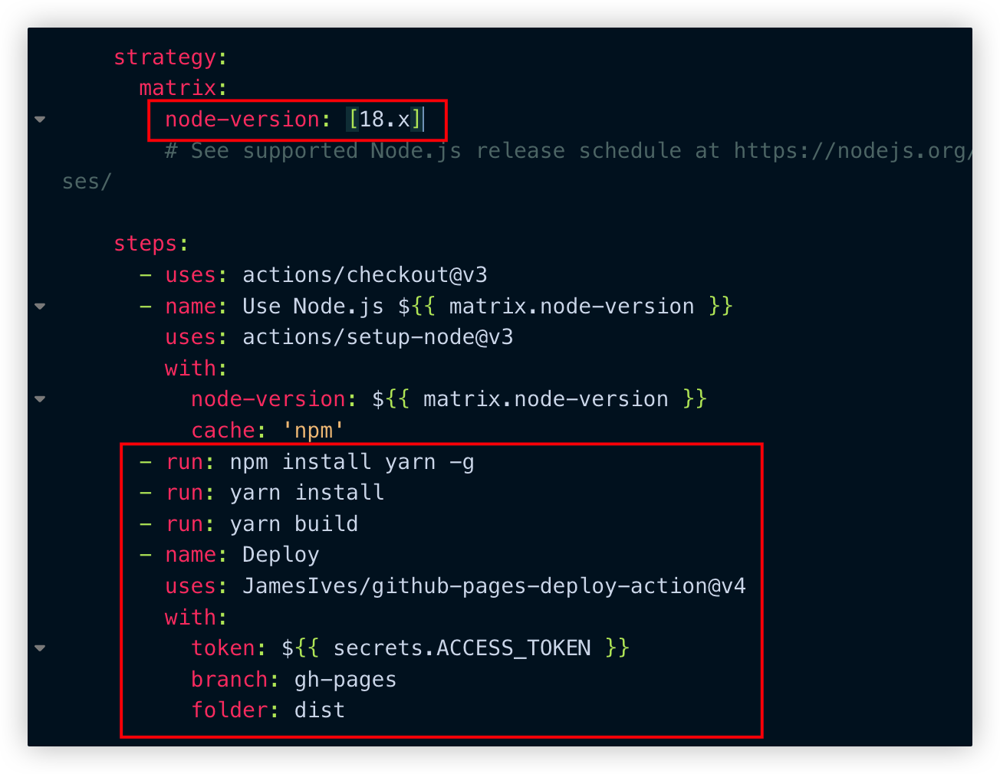

保存之后，就会自己自动化部署了。

这里常见的问题是push的时候权限不足，遇到这种情况，再检查下第一步、第二步即可。

### 第四步：切换分支，自动化部署

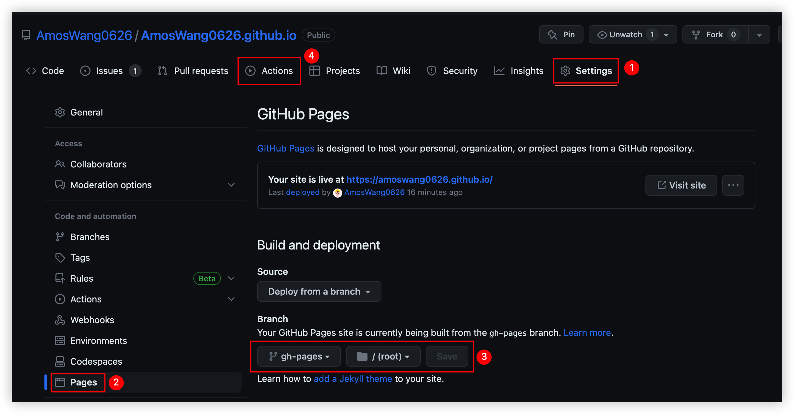

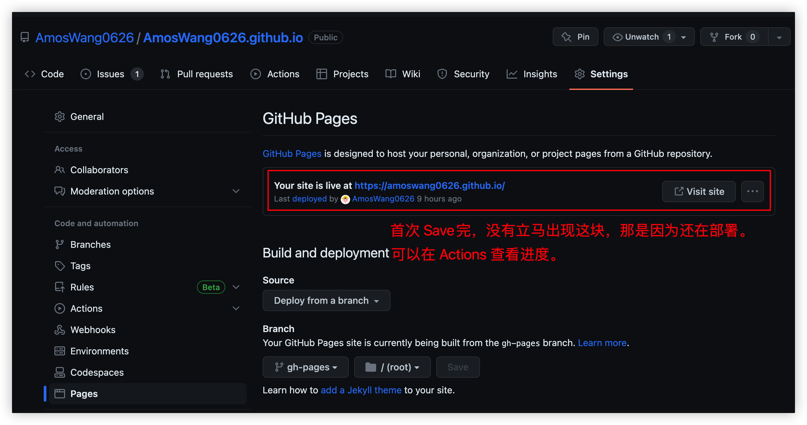

进入 Actions 查看进度，等 deploy 完成就能访问了。

刷新浏览器，可能有几秒缓存，不慌，多刷几次就好了。

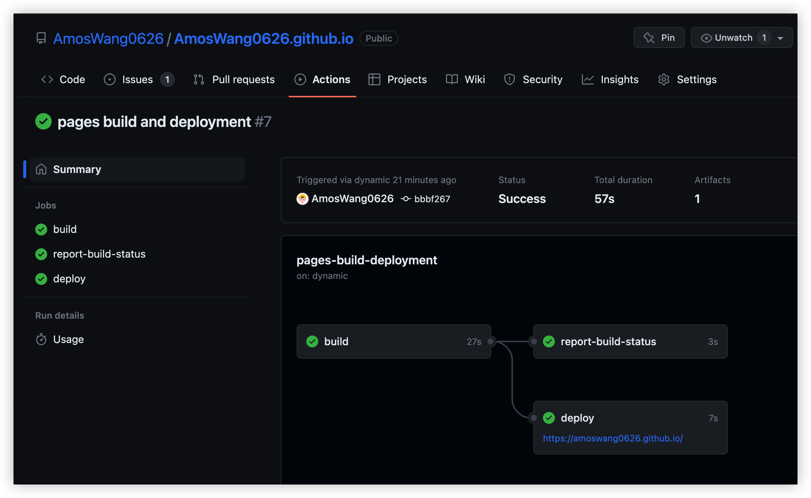

## 相关问题：

### Deploy 时报 403，也即权限不足

1.  检查**个人维度**的 Github Token，Token 的名字随意
1.  检查**项目维度**的变量设置，变量的名字一定要和 node 脚本里的一致

<!---->

1.  1.  例如：ACCESS_TOKEN

### Invalid username or password.

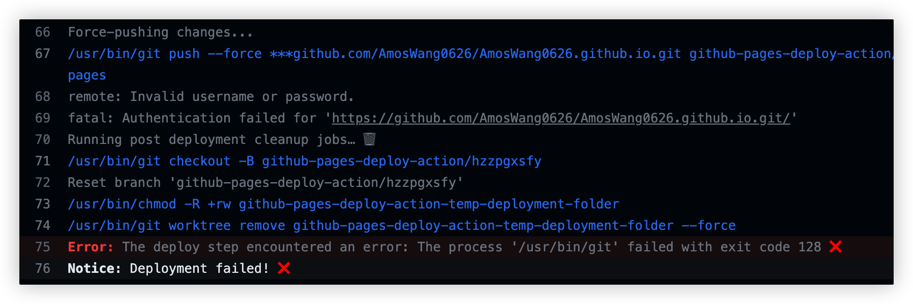

这种就是 token 更新了，需要换下 ACCESS_TOKEN 的值。

### 博客部署完成，页面样式错误

也即静态文件加载不到了。

这是因为部署的站点不在个人 xxx.github.io 下边，请求路径例如 xxx.github.io/xxx_blog

-   静态文件的路径也需要通过 xxx.github.io/xxx_blog/assets/xxx.css 这样访问。
-   但默认不配置 base 的时候，是直接在根域名下访问静态文件的，xxx.github.io/assets/xxx.css 这种。
-   配置base的时候，两端的 / 不能少哦。

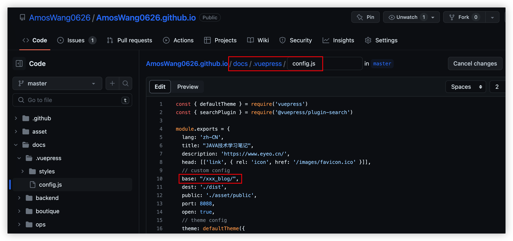