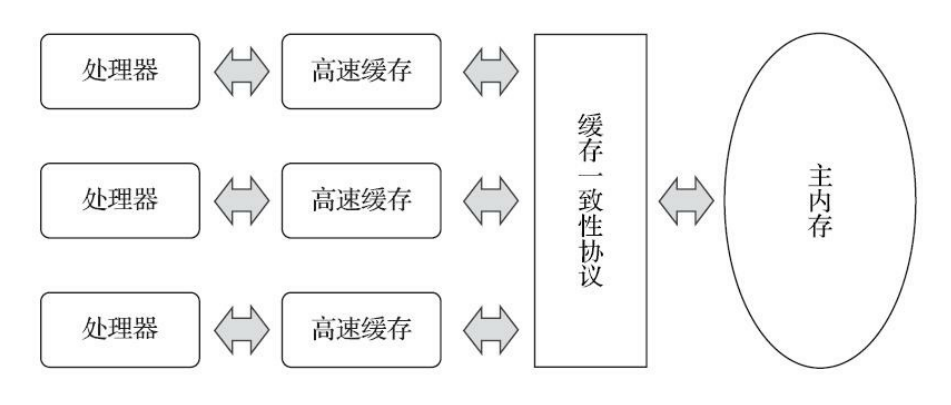
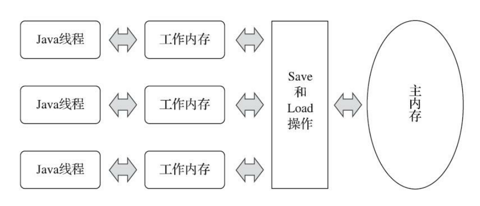
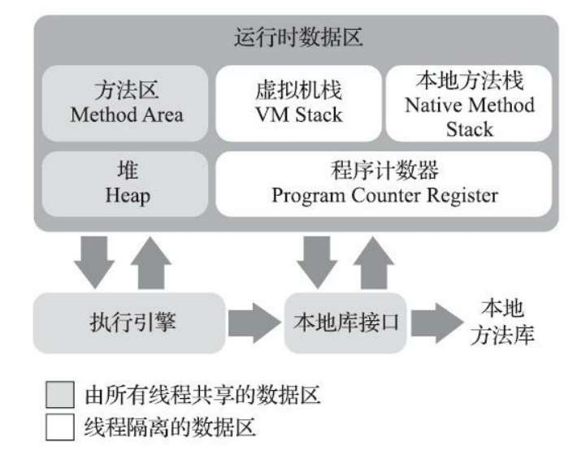

本文从三方面展开：
1. 并发有什么好处
2. 并发带来的问题
3. 这些问题如何解决

JDK 提供了诸多解决方案，请参考后续文章。

## 1. 并发有什么好处

并发可以充分利用CPU资源，降低系统响应时间，提升系统吞吐量。

**并发处理的广泛应用是使得 Amdahl 定律代替摩尔定律成为计算机性能发展源动力的根本原因，也是人类“压榨”计算机运算能力的最有力武器。** —— 引自《深入理解Java虚拟机》

**摩尔定律：** 摩尔定律是指IC上可容纳的晶体管数目，约每隔18个月便会增加一倍，性能也将提升一倍。由英特尔名誉董事长戈登·摩尔1965年提出。**但是，时间是无穷的，IC上可容纳的晶体管数目也是有极限的。**

**Amdahl 定律：** 在一个系统中，并行化和串行化的比重，描述了多处理器系统能获得的运算加速能力。**对于串行化的任务，计算机处理器再多也无用；对于可并行的任务，处理器越多，自然是越快的。**

## 2. 并发带来的问题

多线程情况下会存在并发的问题，主要集中在多个线程同时访问共享资源时，因操作顺序不确定性导致数据不一致，因CPU缓存不一致导致的对共享变量修改不可见等。

相关的问题可以归纳为三类，可见性、有序性和原子性。

可以看个简单的例子，你觉得这个结果会是多少？

```java
public class Test {
    int i = 0;

    @Test
    public void testIncrement() throws Exception {
        Thread thread = new Thread(() -> {
            for (int j = 0; j < 100000; j++) {
                i++;
            }
        });
        Thread thread2 = new Thread(() -> {
            for (int j = 0; j < 100000; j++) {
                i++;
            }
        });
        thread.start();
        thread2.start();
        Thread.sleep(1000); // 休眠等待下
        System.out.println("i=" + i);
    }
}
```

## 3. 这些问题如何解决

下文都是多核的情况下，我们从 计算机内存模型 和 Java内存模型 两方面来看。

### 3.1 计算机内存模型
> 现在的计算机，一般都是多核架构，我们常用的服务器配置 4C8G，也是4个核心的。

计算机内存模型（Memory Model）定义了多核系统中，内存访问操作的可见性、顺序性和原子性的规则。它是硬件和编程语言层面实现多线程同步的基础，确保不同线程对共享数据的读写行为符合预期。
**目标就是解决多核系统的并发问题**。

#### **可见性：处理器缓存带来的缓存一致性问题**

由于计算机的内存和处理器的运算速度有着几个数量级的差距，所以现代计算机不得不加入一层或多层读写速度尽可能接近处理器运算速度的高速缓存。
- 目前主流的高速缓存分为三级，L1/L2 缓存位于每个 CPU 核心内部，L3 缓存位于 CPU 芯片内但由所有核心共享；
- 存储器的层次结构：CPU 寄存器 → L1 缓存 → L2 缓存 → L3 缓存 → 主内存（RAM） → 磁盘/SSD。
- 高速缓存与主内存的对比：
  | **特性**       | **L1/L2 缓存**                  | **L3 缓存**                    | **主内存（RAM）**              |
  |----------------|--------------------------------|--------------------------------|-------------------------------|
  | **位置**       | CPU 核心内部                   | CPU 芯片内部（共享）           | 主板上的独立内存条            |
  | **速度**       | 极快（1~20 周期）              | 较快（30~50 周期）             | 慢（100~300 周期）            |
  | **容量**       | 小（KB~MB 级）                 | 较大（MB 级）                  | 大（GB 级）                   |
  | **材料**       | SRAM（静态随机存储器）          | SRAM                           | DRAM（动态随机存储器）         |
  | **功耗**       | 高                            | 较高                           | 低                            |

高速缓存作为内存和处理器之间的缓冲，**处理器将运算需要使用的数据复制到缓存中，让运算能快速进行，当运算结束后再从缓存同步回内存中。**

这样就引入了新的缓存一致性问题，每个处理器都有自己的高速缓存，而它们又共享一个主内存。
当涉及同一块主内存区域读写时，各处理器复制到自己缓存的时间不一样，各缓存里的值就可能不一样；如果再同步回主内存，要以谁的数据为准呢？



**缓存一致性问题解决方案：**

实现缓存一致性协议。处理器访问缓存时需遵循对应协议，最出名的就是 Intel 的 [MESI](https://zh.wikipedia.org/wiki/MESI协议) 了。

通过缓存行状态（Modified/Exclusive/Shared/Invalid）保证多核缓存的数据一致性，MESI也就是这几个状态的首字母拼接。

| 状态             | 描述                   |
| :--------------- | :------------------------------- |
| 修改 Modified  | 缓存行是脏的（*dirty*），与主存的值不同。如果别的 CPU内核要读主存这块数据，该缓存行必须写回（*flush*）主存，变为共享状态(S)。|
| 独享 Exclusive | 缓存行只在当前缓存中，并且是干净的（*clean*），与主存的值相同。当别的缓存读取它时，变为共享状态(S)；当前写数据时，变为修改状态(M)。|
| 共享 Shared    | 缓存行也存在于其它缓存中，并且是干净的。缓存行可以在任意时刻抛弃。|
| 无效 Invalid   | 缓存行是无效的。|

请注意，它解决的是**缓存层的可见性问题**，不能解决顺序性和原子性的问题。

#### **原子性：并发修改同一块数据**

这个问题但凡涉及并发修改同一块数据就有可能发生，怎么解决呢？

**核心机制**
| **机制**         | **描述**                                                                 | **示例指令**              |
|------------------|-------------------------------------------------------------------------|--------------------------|
| **总线锁定**     | 通过 `LOCK` 前缀指令锁定内存总线，阻止其他 CPU 访问内存，直到操作完成。       | `LOCK XADD`, `LOCK CMPXCHG` |
| **缓存行锁定**   | 利用 MESI 协议，将缓存行标记为独占状态（Modified/Exclusive），原子操作期间阻止其他核心修改。 | 隐式支持（如 `XCHG` 指令） |
| **原子指令**     | 单条指令完成“读-改-写”操作，硬件保证其原子性。                              | `XCHG`, `CMPXCHG16B`     |

**常见的原子指令**
| **指令**         | **功能**                               | **原子性保障**                     |
|------------------|---------------------------------------|-----------------------------------|
| `XCHG`          | 交换寄存器和内存内容                    | 隐含 `LOCK` 语义（即使未显式使用） |
| `CMPXCHG`       | 比较并交换（Compare-and-Swap, CAS）    | 需配合 `LOCK` 前缀实现多核原子性   |
| `CMPXCHG16B`    | 128 位 CAS（用于实现双字原子操作）       | 需显式 `LOCK` 前缀              |
| `XADD`          | 原子加法（交换并相加）                  | 需 `LOCK` 前缀                  |

**带 `LOCK` 前缀的指令**
- **作用**：强制总线锁定或缓存行锁定，确保指令的原子性。
  ```asm
  ; 原子递增操作示例
  lock add dword [rdi], 1  ; 对内存地址 rdi 的值原子加1
  ```
- **性能代价**：总线锁定会阻塞其他 CPU 的内存访问，高并发场景下可能成为瓶颈。

**缓存一致性协议（MESI）与原子性协同**
1. **锁定缓存行**：执行原子操作前，核心将缓存行标记为 Modified 或 Exclusive。
2. **执行操作**：在本地缓存行完成修改。
3. **同步状态**：通过 MESI 协议将修改广播到其他核心，使其缓存行失效（Invalid）。
4. **释放锁定**：操作完成后，缓存行状态恢复为 Shared 或 Exclusive。

总结就是，通过硬件指令和缓存协议协同工作，为上层提供了高效的原子性保障。

#### **顺序性：处理器指令重排带来的顺序性问题**

为了使处理器内部的运算单元能尽量地被充分利用，处理器可能会对输入代码进行乱序执行。

解决这个问题，计算机层面通过内存屏障（Memory Barrier）实现。

内存屏障是硬件或编译器插入的指令，用于限制指令重排序和强制缓存同步。

| **屏障类型**       | **作用**                                  |
|--------------------|------------------------------------------|
| **LoadLoad**       | 禁止屏障前后的读操作重排序。              |
| **StoreStore**     | 禁止屏障前后的写操作重排序。              |
| **LoadStore**      | 禁止前面的读操作与后面的写操作重排序。    |
| **StoreLoad**      | 禁止前面的写操作与后面的读操作重排序。    |

这些内存屏障类型，偏向于规范上的指导，不同的硬件会有不同的实现。

---

### 3.2 Java 内存模型

Java Memory Model，简称 JMM。它是 Java 多线程环境下访问内存的一套规范，独立于具体硬件，但需要与硬件协作。

它屏蔽了各种硬件和操作系统的内存访问差异，以实现让Java程序在各种平台下都能达到一致的内存访问效果。

在此之前，主流程序语言（如C和C++等）直接使用物理硬件和操作系统的内存模型。

**1. 主内存与工作内存**

通俗地说，工作内存就是线程私有的内存，主内存就是线程共享的内存。

工作方式：

- 线程修改工作内存的数据，因为是线程私有的，直接修改即可；

- 线程修改主内存的数据，线程不能直接修改主内存数据，需要先将主内存数据 Load 到工作内存，修改完，将数据 Save 到主内存，此时就涉及脏读和并发写的问题了。如何保证呢？也就是下文的内容了——**加锁**。



对照下图，是不是很熟悉？线程隔离数据区、线程共享数据区。



**2. 原子性、可见性与有序性**

- **原子性**（*不可分割*）

  - 基本数据类型的访问、读写都是具备原子性的。

    由Java内存模型来直接保证的原子性变量操作包括read、load、assign、use、store和write这六个。

    **注意：** 多个原子操作放一起，就不能保证原子性了，例如 i++ 就不是原子操作。

  - synchronized 块之间的操作具备原子性。

    如果应用场景需要一个更大范围的原子性保证（经常会遇到），Java内存模型还提供了 lock 和 unlock 操作来满足这种需求，尽管虚拟机未把 lock 和 unlock 操作直接开放给用户使用，但是却提供了更高层次的字节码指令 monitorenter 和 monitorexit 来隐式地使用这两个操作，也即 synchronized 的底层实现。

- **可见性**（*当一个线程修改了共享变量的值时，其他线程能够立即得知这个修改*）

  Java内存模型是通过在变量修改后将新值同步回主内存，在变量读取前从主内存刷新变量值这种依赖主内存作为传递媒介的方式来实现可见性的。

  - volatile 实现可见性

    volatile 的特殊规则保证了新值能立即同步到主内存，以及每次使用前立即从主内存刷新。

  - synchronized 实现可见性
    对一个变量执行unlock操作之前，必须先把此变量同步回主内存中（执行store、write操作）

  - final 实现可见性

    被final修饰的字段在构造器中一旦被初始化完成，并且构造器没有把“this”的引用传递出去（this引用逃逸是一件很危险的事情，其他线程有可能通过这个引用访问到“初始化了一半”的对象），那么在其他线程中就能看见final字段的值。

- **有序性**（*线程内表现为串行的语义 As-If-Serial*）

  程序代码的执行顺序可能和我们写的代码顺序不一致。因为在同一个线程的方法执行过程中无法感知到这点，这就是Java内存模型中描述的所谓“线程内表现为串行的语义”（Within-Thread As-If-Serial Semantics）。

  - volatile 实现有序性

    volatile 包含了禁止指令重排序的语义。相当于一个内存屏障（Memory Barrier或Memory Fence，指重排序时不能把后面的指令重排序到内存屏障之前的位置），只有一个处理器访问内存时，并不需要内存屏障；但如果有两个或更多处理器访问同一块内存，且其中有一个在观测另一个，就需要内存屏障来保证一致性了。

  - synchronized 实现有序性

    一个变量在同一个时刻只允许一条线程对其进行lock操作，持有同一个锁的两个同步块只能串行地进入。

**先行发生原则（happens-before）**

Java 天生支持先行发生原则，具体原则如下。如果两个操作之间的关系不在此列，并且无法从下列规则推导出来，则它们就没有顺序性保障，虚拟机可以对它们随意地进行重排序。

- 程序次序规则（在一个线程内，按照程序代码顺序，书写在前的先行于书写在后的。准确讲，是控制流顺序）
- 管程锁定规则（一个 unlock 操作先行于后边对同一个锁的 lock 操作。后边指时间上的先后顺序）
- volatile 变量规则（对一个变量的写操作先行于后边读操作。后边同样指时间上的先后顺序）
- 线程启动规则（Thread.start() 先行于此线程的每一个动作）
- 线程终止规则（线程中的所有操作都先行于对此线程的终止监测）
- 线程中断规则（Thread.interrupt() 方法的调用先行于中断代码的监测）
- 对象终结规则（一个对象的初始化完成先行于它的 finalize()）
- 传递性（A先行发生于B，B先行发生于C，则可得出操作A先行发生于C的结论）

---

## 4. JDK自带关键字

### 4.1 synchronized

> 默认为偏向锁，如果竞争激烈，会自动升级。（偏向锁 > 轻量级锁 > 重量级锁）；JDK 1.6 之前为重量级锁。

1. 加锁方式

   - 同步方法
     1. 静态方法
     2. 非静态方法

   - 同步代码块
     1. 对象锁
     2. 类锁（本质上也是对象锁，ClassLoader 加载的类，都有一个 Class 对象）

2. 解决问题

   原子性：同一时间，只允许一个线程持有某个对象锁，保证原子性。

   可见性：锁释放之前，对共享变量的修改，对于随后获取该锁的线程是可见的。

   有序性：持有同一个锁的两个同步块只能串行地进入，保证了有序性。

3. 实现原理

   这两个都是使用管程（Monitor，更常见的是直接将它称为“锁”）来实现的。

   - 同步方法

     方法级的同步是隐式的，无须通过字节码指令来控制，它实现在方法调用和返回操作之中。

     虚拟机可以从方法常量池中的方法表结构中的 ACC_SYNCHRONIZED 访问标志得知一个方法是否被声明为同步方法。
     如果设置了，执行线程就要求先成功持有管程，然后才能执行方法，最后当方法完成（无论是正常完成还是非正常完成）时释放管程。
     在方法执行期间，执行线程持有了管程，其他任何线程都无法再获取到同一个管程。
     如果一个同步方法执行期间抛出了异常，并且在方法内部无法处理此异常，那这个同步方法所持有的管程将在异常抛到同步方法边界之外时自动释放。

   - 同步代码块

     Java虚拟机的指令集中有 monitorenter 和 monitorexit 两条指令来支持 synchronized 关键字的语义，正确实现 synchronized 关键字需要 javac 编译器与 Java虚拟机两者共同协作支持。

     ```java
     void onlyMe(Foo f) {
         synchronized (f) {
             doSomething();
         }
     }
     ```
     ```c
     Method void onlyMe(Foo)
     0 aload_1		// 将对象f入栈
     1 dup			// 复制栈顶元素（即f的引用）
     2 astore_2		// 将栈顶元素存储到局部变量表变量槽 2中
     3 monitorenter	// 以栈定元素（即f）作为锁，开始同步
     4 aload_0		// 将局部变量槽 0（即this指针）的元素入栈
     5 invokevirtual #5	// 调用doSomething()方法
     8 aload_2 		// 将局部变量Slow 2的元素（即f）入栈
     9 monitorexit 	// 退出同步
     10 goto 18 		// 方法正常结束，跳转到18返回
     13 astore_3 	// 从这步开始是异常路径，见下面异常表的Taget 13
     14 aload_2 		// 将局部变量Slow 2的元素（即f）入栈
     15 monitorexit 	// 退出同步
     16 aload_3 		// 将局部变量Slow 3的元素（即异常对象）入栈
     17 athrow 		// 把异常对象重新抛出给onlyMe()方法的调用者
     18 return 		// 方法正常返回
     Exception table:
     FromTo Target Type
     4 10 13 any
     13 16 13 any
     ```

     编译器必须确保无论方法通过何种方式完成，方法中调用过的每条 monitorenter 指令都必须有其对应的 monitorexit 指令，而无论这个方法是正常结束还是异常结束。

### 4.2 volatile

> 可见性和有序性轻量级解决方案。

1. 加锁方式

   定义在变量上

2. 解决问题

   可见性：新值能立即同步到主内存，以及每次使用前立即从主内存刷新。

   有序性：禁止指令重排序，重排序时不能把后面的指令重排序到内存屏障之前的位置。

3. 实现原理

    禁止指令重排序，保障新值的可见性。结合 DCL 编译后的源码看一下 ↓↓↓↓↓

    ```java
    public class Singleton {
        private volatile static Singleton instance;
    
        public static Singleton getInstance() {
            if (instance == null) {
                synchronized (Singleton.class) {
                    if (instance == null) {
                        instance = new Singleton();
                    }
                }
            }
            return instance;
        }
    
        public static void main(String[] args) {
            Singleton.getInstance();
        }
    }
    ```

    ```c
    0x01a3de0f: mov $0x3375cdb0,%esi        ;...beb0cd75 33
                                            ; {oop('Singleton')}
    0x01a3de14: mov %eax,0x150(%esi)        ;...89865001 0000
    0x01a3de1a: shr $0x9,%esi               ;...c1ee09
    0x01a3de1d: movb $0x0,0x1104800(%esi)   ;...c6860048 100100
    0x01a3de24: lock addl $0x0,(%esp)       ;...f0830424 00
                                            ;*putstatic instance
                                            ; - Singleton::getInstance@24
    ```

    **关键指令：`lock addl $0x0,(%esp)`**

    这句指令中的`addl $0x0,(%esp)`（把ESP寄存器的值加0）显然是一个空操作，之所以用这个空操作而不是空操作专用指令`nop`，是因为IA32手册规定`lock`前缀不允许配合`nop`指令使用。

    这里的关键在于 **`lock`前缀，它的作用是将本处理器的缓存写入了内存，该写入动作也会引起别的处理器或者别的内核缓存无效（Invalidate）** ，这种操作相当于对缓存中的变量做了一次前面介绍Java内存模式中所说的`store`和`write`操作。所以通过这样一个空操作，可让前面volatile变量的修改对其他处理器立即可见。

    与此同时，**`lock addl$0x0,(%esp)`指令把修改同步到内存时，意味着所有之前的操作都已经执行完成，这样便形成了“指令重排序无法越过内存屏障”的效果。**

